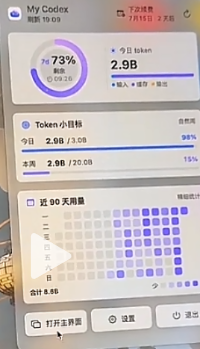
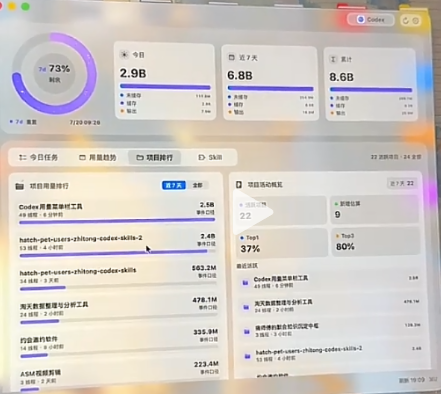

# My Codex

## 0.1.2 交付说明

当前版本采用 Windows 绿色版交付：解压后直接运行 `my-codex.exe`，不需要安装器，也不会写入传统安装目录。胶囊悬浮窗支持拖动；鼠标停留约 140 毫秒后展开 My Codex，鼠标离开整个 My Codex 界面后自动收起；如果悬停不方便，也可以单击或双击胶囊打开。展开后的 My Codex 面板同样可以拖动。

发布目录必须保留 EXE 旁边的 `WebView2Loader.dll`、资源目录及其他 Tauri 运行文件，不能只单独复制 EXE。

My Codex 是一款本地优先的 Codex 配套桌面应用，提供额度悬浮窗、Token 使用统计、项目/Skill/模型分析和缓存分析。桌面端采用 Tauri 2 + Rust + React + TypeScript；浏览器预览自动使用明确标识的 Mock 数据。

> 当前交付状态（2026-08-12）：仓库包含可开发、可测试的源代码与桌面打包配置，但本次执行环境缺少 Rust、MSVC 和 Windows SDK，**尚未产出或验证 `My Codex.exe`、NSIS `.exe` 安装包和 `.msi` 安装包**。真实在线额度也尚未用登录账户完成端到端验收。Mock 数字只用于界面演示，不会冒充真实数据。

## 截图与设计参考

| 桌面额度悬浮窗 | 主控制台 |
| --- | --- |
|  |  |

参考图用于布局比例、视觉密度、毛玻璃、渐变仪表盘、热力图和排行榜的设计校准，不代表真实账户数据。

## 功能

- 双窗口：约 280 × 430 的无边框悬浮窗，以及可缩放主 Dashboard；Compact Mode 约 110 × 48。
- 额度视图：主/次额度窗口、剩余百分比、重置时间、最后成功更新时间和异常状态。
- 本地分析：今日/近 7 天/累计 Token、90 天热力图、项目/Skill/模型/缓存排行。
- 数据来源标签：`官方数据`、`本地统计`、`估算`、`Mock`，每项数据都可追溯来源。
- 状态保护：加载中、未登录、数据过期、网络不可用和协议结构变化时显示明确状态，不生成假数字。
- 智能刷新：single-flight 防并发、按可见性/活跃度调整频率、失败指数退避；倒计时在本地逐秒计算，不逐秒请求服务。
- 本地设置：主题、置顶、锁定位置、自动收起、刷新频率、通知阈值等。
- Windows 优先：托盘、全局快捷键、开机启动与 NSIS/MSI 打包配置；架构保留 macOS 兼容边界。
- Mock Mode：在未安装或未登录 Codex 时也能完整查看 UI；所有 Mock 数据均有显著标识。

实现和验收范围详见 [验收清单](docs/acceptance.md)。

## 安装

当前仓库没有经过验证的安装包，请不要把源码目录中的任意 `.exe` 当作正式发布物。待具备完整 Windows 工具链并通过验收后，预期产物位于：

```text
src-tauri/target/release/my-codex.exe
src-tauri/target/release/bundle/nsis/*.exe
src-tauri/target/release/bundle/msi/*.msi
```

Windows 正式构建需要：

- Windows 11（x64）
- Node.js 20+
- Rust stable（MSVC toolchain）
- Visual Studio 2022 Build Tools 的“使用 C++ 的桌面开发”工作负载
- Windows 10/11 SDK
- WebView2 Runtime（Windows 11 通常已安装）

开发者可在这些依赖齐全后运行：

```powershell
powershell -ExecutionPolicy Bypass -File .\scripts\build-windows.ps1
```

脚本会依次执行前端类型检查、前端测试、Rust 检查、Rust 测试和 Tauri 打包，并列出实际生成的文件。构建命令成功不等同于签名或发布验收；公开分发前仍需进行 Windows SmartScreen、安装/卸载和干净机器测试。

## Codex 登录要求

真实模式要求本机已安装可用的 Codex，并已通过 Codex 自己的登录流程登录。My Codex 不要求、也不应要求用户再次输入 OpenAI 密码。

默认适配器通过本机 `codex app-server` 做能力探测：

1. 用 `account/read` 判断账户状态。
2. 用 `account/rateLimits/read` 读取可用的额度窗口；接收 `account/rateLimits/updated` 时按稀疏更新规则合并。
3. 在当前 Codex 版本支持时，用 `account/usage/read` 获取账户 Token 活动摘要和日桶。
4. 若 app-server、登录或字段不可用，真实指标显示 `—`、`数据不可用` 或 `数据已过期`，不会回退为未标识的 Mock 数字。

认证凭据由 Codex 管理。My Codex 的设计目标是不读取、记录或持久化 Access Token；协议能力和兼容性研究见 [参考项目研究](docs/reference-research.md)。

## 数据来源

| 标签 | 含义 | 典型指标 |
| --- | --- | --- |
| 官方数据 | Codex app-server 返回的账户信息 | 套餐、额度窗口、已用百分比、重置时间；可用时的账户 Token 活动 |
| 本地统计 | 从本机会话/事件中提取允许的结构化元数据后聚合 | 项目 Token、会话数、Skill/模型关联、缓存 Token |
| 估算 | 基于本地事件时间边界和明确算法推算 | 活跃时长、Skill 关联置信度等 |
| Mock | 仅用于演示和测试的固定数据 | 73% 额度、2.9B 今日用量等参考数字 |

项目排行和 Skill 分析不是 OpenAI 账单。若 Codex 没有提供可验证的细粒度字段，界面必须显示“本地统计”或“估算”。完整字段矩阵和降级规则见 [数据来源说明](docs/data-sources.md)。

## 隐私

My Codex 坚持 Local First：

- 不收集或持久化 Prompt、回复正文、聊天原文、项目代码或文件内容。
- 不向第三方上传 Access Token、聊天记录、项目路径或统计数据库。
- 不包含第三方遥测、广告、行为追踪或崩溃上报。
- 本地分析只保留聚合指标和必要的本地标识；项目路径即使保存在本地，也不会被上传。
- 日志必须脱敏，不输出 Token、账户 ID、Prompt、原始事件或完整私有路径。
- 删除本地数据后不提供云端恢复，因为本项目不建立同步账户。

详细边界、允许/禁止项和威胁模型见 [隐私边界](docs/privacy-boundary.md)。

## 开发

安装依赖：

```powershell
npm.cmd install
```

浏览器 Mock 预览：

```powershell
npm.cmd run dev
```

桌面开发（需要 Rust/MSVC/Windows SDK）：

```powershell
npm.cmd run tauri:dev
```

质量检查：

```powershell
npm.cmd run typecheck
npm.cmd run test
npm.cmd run build
npm.cmd run test:sites
cargo check --manifest-path .\src-tauri\Cargo.toml
cargo test --manifest-path .\src-tauri\Cargo.toml
```

主要目录：

```text
src/                    React UI、stores、hooks、services、types
src-tauri/src/          Rust adapter、本地分析、数据库、托盘与窗口
tests/                  前端/站点测试
docs/                   研究、数据来源、隐私与验收文档
references/             用户提供的视觉参考图
scripts/                可重复构建脚本
```

## 构建与发布

本地 Windows 构建使用：

```powershell
.\scripts\build-windows.ps1
```

只跳过测试（不建议用于发布）：

```powershell
.\scripts\build-windows.ps1 -SkipTests
```

脚本不会伪造产物，也不会在缺少工具链时报告成功。正式发布还应完成：

- 在干净 Windows 11 用户环境安装、启动、升级和卸载。
- 登录/未登录、联网/断网、额度字段变化和数据过期场景。
- Windows 代码签名、时间戳和 SmartScreen 策略（如果面向公众发布）。
- 第三方许可证、隐私文档和产物哈希复核。

## FAQ

### 为什么我看到的是 73%、2.9B 等数据？

这些是需求指定的 Mock 示例。浏览器预览必然使用 Mock；桌面端只有在设置中明确启用 Mock 时才可显示它，并必须带 `Mock` 标识。

### 为什么真实额度显示“数据不可用”？

常见原因包括未登录 Codex、Codex 版本不支持所需 app-server 方法、网络中断、账户未返回该额度窗口或协议字段发生变化。应用应保留最后成功时间；没有可靠值时显示 `—`。

### 会读取我的 Prompt 或项目代码吗？

不会。会话分析只允许提取 Token、时间、模型、工作目录/项目标识和可验证的 Skill 事件等结构化元数据；文本正文与文件内容必须丢弃。

### 项目和 Skill 用量是官方账单吗？

不是。除非未来官方接口明确提供并通过验证，这些数据均标记为“本地统计”；依赖推断的字段还要标记为“估算”和置信度。

### 可以只使用悬浮窗吗？

可以。主面板可隐藏，悬浮窗独立展示额度、重置倒计时和近 90 天本地统计；设置中可控制置顶、锁定位置和自动收起。

### 为什么仓库里还没有安装包？

本次执行环境没有 Rust、MSVC 和 Windows SDK，因此无法诚实地完成 Tauri 原生编译与安装器验证。请在完整 Windows 构建机上运行构建脚本，并以 [验收清单](docs/acceptance.md) 为准。

## 许可证与声明

项目源代码采用 [MIT License](LICENSE)。第三方依赖和研究参考见 [THIRD_PARTY_NOTICES.md](THIRD_PARTY_NOTICES.md)。

**My Codex 是独立社区项目，与 OpenAI 无官方隶属、授权、赞助或背书关系。** OpenAI、ChatGPT、Codex 及相关名称和标识是其各自权利人的商标。使用本项目不改变用户与 OpenAI 或其他服务提供方之间的服务条款。
